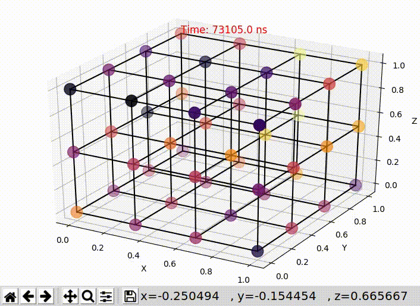
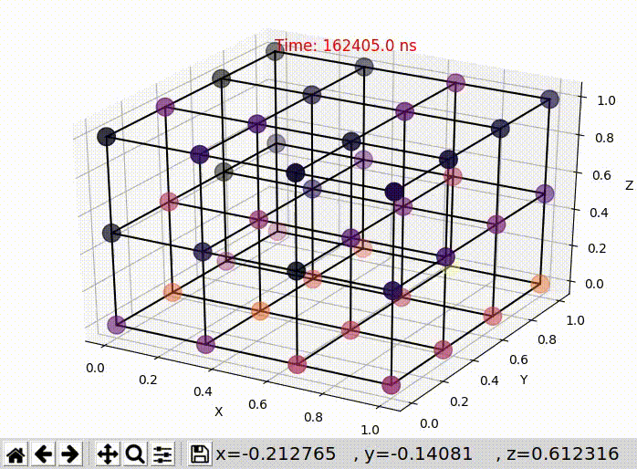

[](https://travis-ci.com/jmjos/ratatoskr)
[](https://www.codefactor.io/repository/github/jmjos/ratatoskr)
[](https://www.codacy.com/app/jmjos/ratatoskr?utm_source=github.com&amp;utm_medium=referral&amp;utm_content=jmjos/ratatoskr&amp;utm_campaign=Badge_Grade)

# Ratatoskr NoC simulator


Welcome to the project website of ratatoskr, an in-depth PPA framework to design NoCs for heterogeneous 3D SoCs. It includes:

- Power estimation:
  - Static and dynamic power estimation of routers and links on a cycle-accurate level. 
  - Accuracy of dynamic link energy is within 1% of bit-level accurate simulations.
- Performance models:
  - Network performance for millions of clock cycles on a cycle-accurate (CA) level using the NoC simulator.  
  - Network performance for thousands of clock cycles on a register-transfer level (RTL). 
  - Timing of routers from synthesis on the gate level.
- Area analysis: NoC area from synthesis on gate-level for any standard cell technology.
- Verification: Gate-level model of NoC enables verification on gate-level against design rule checks (DRCs).
- Benchmarks:
   - Support for realistic application model on transaction-level. 
   - Conventional synthetic traffic patterns.
- Heterogeneous 3D Integration:
   - Heterogeneity yields non-purely synchronous systems, since the same circuit in mixed-signal and digital achieve different maximum clock speeds. Therefore, the NoC simulation and router hardware model implement a pseudo-mesochronous router (cf. Joseph et al. 2018).
   - Heterogeneity yields different number of routers per layers, since (identical) circuits in mixed-signal and digital have different area. Therefore, the NoC simulation allows for any non-regular network topology via XML configuration files.
- Usability: Single point-of-entry to set design parameters. The design parameters allow for rapid testing of different designs.
- Reporting: Automatic generation of detailed reports from network-scale performance to buffer utilization.

Ratatoskr  is developed at the University in Magdeburg, Germany and University of Bremen, Germany. It is under MIT license terms. If you use the simulator in your research, we would appreciate the following citation in any publications to which it has contributed:

---

Jan Moritz Joseph, Sven Wrieden, Christopher Blochwitz, Alberto Garc&iacute;a-Ortiz, Thilo Pionteck: A Simulation Environment for Design Space Exploration for Asymmetric 3D-Network-on-Chip, 11th International Symposium on Reconfigurable Communication-centric Systems-on-Chip (ReCoSoC 2016), Tallinn, 2016

---

A few words on the name: Ratatoskr is a squirrel in nordic mythodology that is running up and down a tree to transmit messages between a dragon and a eagle. Just as a 3D NoC...! 


## Trivia on the framework's name

The name of the framework Ratatoskr is based on a squirrel from Nordic mythology. In the mythological text, the squirrel runs up and down a large tree called Yggdrasil to transport message from an eagle sitting on top of the tree to the dragon Nidhögg lying under the tree. The eagle and the dragon are quite talkative because they are in conflict. Thus, the squirrel is rather busy with its task. The inspiration of the name of our framework comes directly from the squirrels task: Just as a NoC in a heterogeneous 3D SoC, it transmits messages vertically to different senders and receivers. 

## Getting started

Here, we provide a quick tutorial. For in-depth instructions, please visit the [documentation](docs/TOC.md).

Let's start simple. You can a virtualbox image from [here](https://drive.google.com/open?id=1wDSwk0DIyzxVyD3pfzP4sBhK69QrsxN1). Boot it, login with demo/demo (user/pass). You'll find the simulator in ~/ratatoskr. We'll start from there. Let's start a terminal! (If you'd like to install the simulator on your own system, please read the detailed documentation in [the docs](TOC.md).

```bash
cd ~/ratatoskr
```

In this demo system, we already installed all packages and ratatoskr, so you are ready to go. Let's first get the newest version:

```bash
git pull
```

and compile:

```bash
cd ~/ratatoskr/simulator
./build.sh
```

After a short time, you'll get the executable `sim`. Let's run three simple examples!

## Simulating a NoC for a heterogeneous 3D SoCs

In this part, we'll simulate a NoC for a heterogeneous 3D SoC with two 30nm mixed-signal layers on top an a single 15nm digital layer on bottom. We'll use XYZ routing, as published from *Joseph et al. 2019*, and load uniform random traffic. The result will look like this:


Let's generate this figure. Enter the demo folder and copy the executable and the configuration files:

```bash
cd ~/ratatoskr/bin/demo
cp ~/ratatoskr/simulator/sim .
```

We'll the the python venv and copy the required files for the GUI:

```bash
cd ~/ratatoskr/bin/
make
source source_me.sh
cd ~/ratatoskr/bin/demo
cp config/network_heterogeneous.xml network.xml #will be read as network config file for plotting.
python ../plot_network_client.py
```

The GUI script is started and waits for the simulation to run. Let's open a second terminal, in which you run the simulator:

```bash
cp config/config_heterogeneous.xml config/config.xml
cd ~/ratatoskr/bin/demo
./sim
```

## Different traffic patterns

In this part, we'll run uniform random traffic pattern and hotspot traffic pattern and visualize the differences with our GUI. We'll use simple homogeneous networks for comparability to conventional NoCs. Copy the correct configuration files. In the `config` folder, you'll find the configuration of the simulator (`config_homogeneous.xml`) and the network, a 4 * 4 * 3 - NoC (`network.xml`). They are already set up for the uniform random traffic pattern. The simulation is set to 1.5M clock cycles, which will take a while. But that's enough to observe the behavior of the NoC in the GUI! Let's to that:

```bash
cp config/config_homogeneous.xml config/config.xml #for simulator
cp config/network.xml network.xml # for GUI
```

Rerun the simulation by executing `python ../plot_network_client.py` in the first terminal and `./sim` in the second.  A GUI will open and show the buffer usage in each router. It's somewhat random...!



At the end of the simulation after a few minutes, you'll see the performance results:

```
Generating report of the simulation run into file report ...  done.
Average flit latency: 13.86 ns.
Average packet latency: 46.64 ns.
Average network latency: 46.64 ns.
```

Next, let's use hotspot traffic pattern. Therefore, we configure the simulator. Close the GUI by pressing `q` in the window or using `Crtl-C` in the terminal. Change line 26 of the `config/config.xml` file from

```xml
<phase name="run">
  <distribution value="uniform"/>
  <start max="1100" min="1100"/>
```
to
```xml
<phase name="run">
  <distribution value="hotspot"/>
  <start max="1100" min="1100"/>
```

Rerun the simulation by executing `python ../plot_network_client.py` in the first terminal and `./sim` in the second. You'll recieve a rather boring but expected network load:


## Different routing algorithms

Let's use the heterogeneous XYZ routing, which puts more load to lower layers. This differs from conventional XYZ routing. Therefore, we reconfigure the `config/network.xml` by changing the router properties in lines 12, 19, and 26 from

```xml
<nodeType id="0">
     <model value="RouterVC"/>
     <routing value="XYZ"/>
     <selection value="1stFreeVC"/>
     <clockDelay value="1"/>
     <arbiterType value="fair"/>
   </nodeType>
```
to
```xml
<nodeType id="0">
     <model value="RouterVC"/>
     <routing value="HeteroXYZ"/>
     <selection value="1stFreeVC"/>
     <clockDelay value="1"/>
     <arbiterType value="fair"/>
   </nodeType>
```
Remember to repeat three times! Also, we'll use uniform random traffic again, so update the `config/config.xml` (revert the changes made before).

Finally, you'll receive the following:



For further instructions, please use our [documentation](TOC.md). There, we also provide instrucions how to compile the simulator.

## Contributing
If you wish to contribute, please contact me at my univeristy email address jan.joseph@ovgu.de. We offer student development jobs for students from Magdeburg.

## People
The following people participated:
- [Lennart Bamberg](github.com/lennartjanis): Physical models, hardware implementation and optimization
- [Jan Moritz Joseph](https://github.com/jmjos): Simulation tools and design optimization
- [Prof. Dr.-Ing. Alberto García-Ortiz](www.ids.uni-bremen.de/agarcia.html): PI
- [Prof. Dr.-Ing. Thilo Pionteck](http://www.iikt.ovgu.de/pionteck.html): PI
- [Imad Hajjar](https://github.com/imadhajjar): Implementation of the simulator
- [Behnam Razi Perjikolaei](https://github.com/behnamrazi): Implementation of the router
- Dominik Ermel: Implementation of optimization models
- Sven Wrieden: Parts of the Implementation of version 1.0

## Acknolegdements

This work is funded by the German Research Foundation (DFG) project GA 763/7-1 and PI 477/8-1.

We are very grateful for the help of [Prof. Dr. Volker Kaibel](https://www.math.uni-magdeburg.de/~kaibel/).

## License

This simulator is available to anybody free of charge, under the terms of MIT License:

Copyright (c) 2018 Jan Moritz Joseph

Permission is hereby granted, free of charge, to any person
obtaining a copy of this software and associated documentation
files (the "Software"), to deal in the Software without
restriction, including without limitation the rights to use,
copy, modify, merge, publish, distribute, sublicense, and/or sell
copies of the Software, and to permit persons to whom the
Software is furnished to do so, subject to the following
conditions:

The above copyright notice and this permission notice shall be
included in all copies or substantial portions of the Software.

THE SOFTWARE IS PROVIDED "AS IS", WITHOUT WARRANTY OF ANY KIND,
EXPRESS OR IMPLIED, INCLUDING BUT NOT LIMITED TO THE WARRANTIES
OF MERCHANTABILITY, FITNESS FOR A PARTICULAR PURPOSE AND
NONINFRINGEMENT. IN NO EVENT SHALL THE AUTHORS OR COPYRIGHT
HOLDERS BE LIABLE FOR ANY CLAIM, DAMAGES OR OTHER LIABILITY,
WHETHER IN AN ACTION OF CONTRACT, TORT OR OTHERWISE, ARISING
FROM, OUT OF OR IN CONNECTION WITH THE SOFTWARE OR THE USE OR
OTHER DEALINGS IN THE SOFTWARE.
